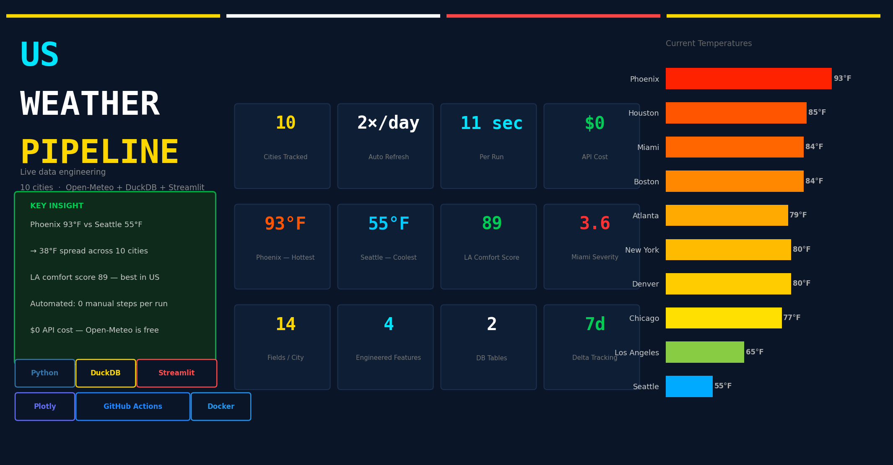
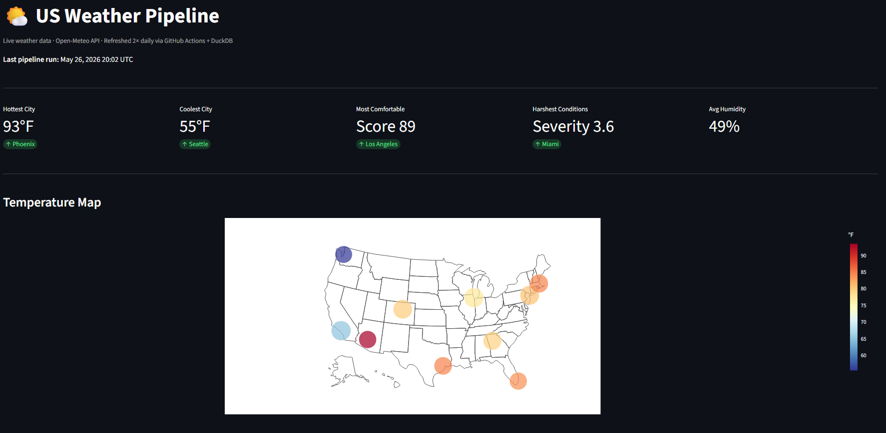
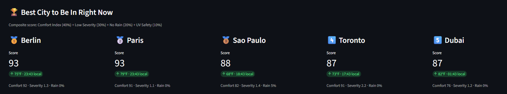
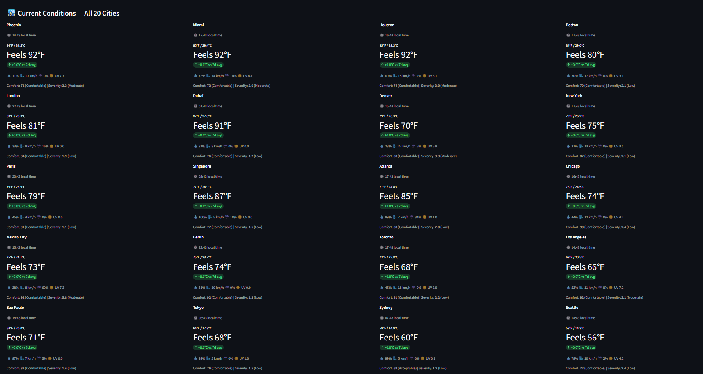
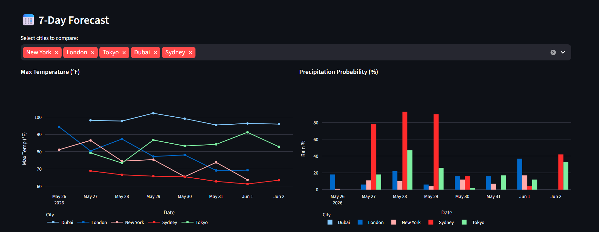
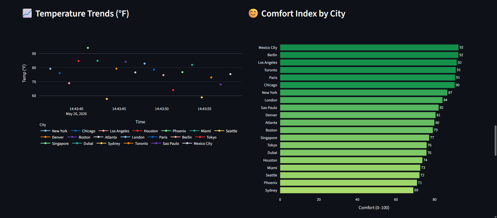
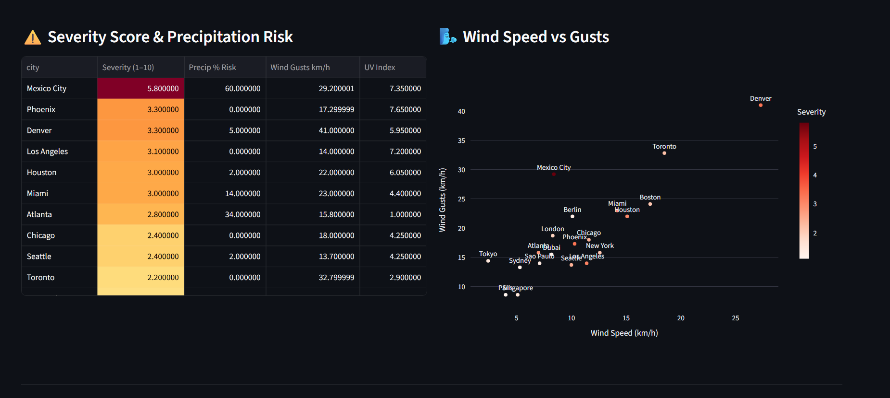
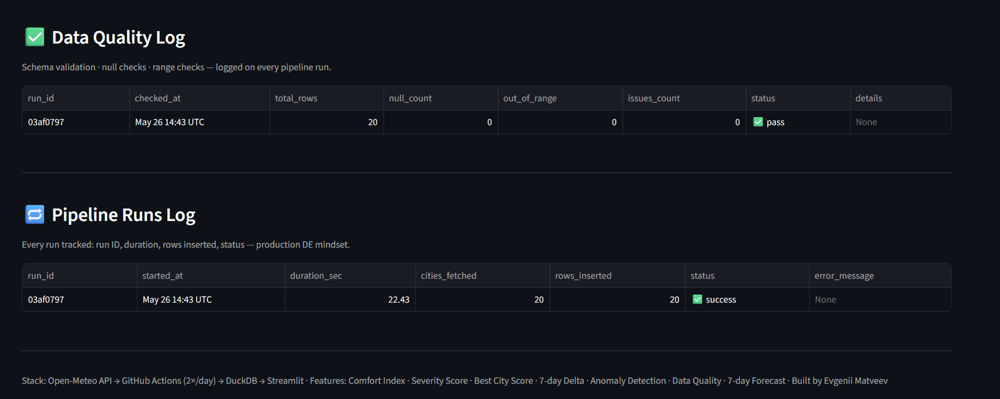

# 🌍 Global Weather Pipeline


[](https://huggingface.co/spaces/evgeniimatveevusa/weather-pipeline)



Production-grade live weather pipeline for **20 global cities across 6 continents** — from API ingestion to engineered features, DuckDB storage, and a real-time Streamlit dashboard. Refreshed automatically **twice a day** via GitHub Actions. Zero manual steps after deploy.

> "Built an end-to-end data engineering pipeline: API → validate → transform → store → visualize → automate. 20 cities. 4 tables. 7-day forecasts. $0 infrastructure cost."

**[Live Demo → HuggingFace Spaces](https://huggingface.co/spaces/evgeniimatveevusa/weather-pipeline)**

---

## Screenshots

<details>
<summary>🗺️ World Temperature Map & KPI Row</summary>



</details>

<details>
<summary>🏆 Best City Right Now Ranking</summary>



</details>

<details>
<summary>🏙️ Current Conditions — All 20 Cities</summary>



</details>

<details>
<summary>📅 7-Day Forecast Tab</summary>



</details>

<details>
<summary>😊 Temperature Trends & Comfort Index</summary>



</details>

<details>
<summary>⚠️ Severity Score & Wind Analysis</summary>



</details>

<details>
<summary>✅ Data Quality Log & Pipeline Runs</summary>



</details>

---

## Key Metrics (Live Data)

| Metric | Value |
|--------|-------|
| Cities tracked | **20 global cities — 10 US + 10 international** |
| Continents covered | **6** (North America, Europe, Asia, Oceania, South America, Middle East) |
| Pipeline frequency | **2× daily** — 8am ET + 8pm ET |
| Pipeline runtime | **~45 seconds** per run |
| Data fields per city | **10 raw + 5 engineered** |
| Engineered features | Comfort Index · Severity Score · Best City Score · 7d Delta · Anomaly Flag |
| Forecast rows per run | **140** (20 cities × 7 days) |
| DuckDB tables | **4** — weather_history, forecast_history, data_quality_log, pipeline_runs |
| Data quality checks | Null checks · Range validation · Row count guard |
| API cost | **$0** — Open-Meteo is free, no key required |
| Storage | DuckDB embedded — full history, zero ops |

---

## Architecture

```
Open-Meteo API (free · no key)
        ↓  httpx — sequential fetch with local timezone
   extract.py  ← 20 cities · current weather + 7-day daily forecast
        ↓  pandas transforms
   transform.py  ← temperature_f · feels_like_f · comfort_index · severity_score · best_city_score
        ↓  validate.py  ← null checks · range checks · row count guard
   data/weather.duckdb
        ├── weather_history     ← all runs appended
        ├── forecast_history    ← 7-day daily forecast per city
        ├── data_quality_log    ← pass/warn/fail per run
        └── pipeline_runs       ← audit log per run
        ↓  upload_db.py
   HuggingFace Dataset (evgeniimatveevusa/weather-db)
        ↓  Streamlit reads from HF at startup
   Dashboard (8 sections · Plotly)
        ↓  Docker
   HuggingFace Spaces (always-on · auto-rebuild)
        ↑
   GitHub Actions (cron 2×/day · workflow_dispatch)
```

---

## Cities Covered

| Region | Cities |
|--------|--------|
| **US** | New York · Chicago · Los Angeles · Houston · Phoenix · Miami · Seattle · Denver · Boston · Atlanta |
| **Europe** | London · Paris · Berlin |
| **Asia** | Tokyo · Singapore · Dubai |
| **Oceania** | Sydney |
| **Americas** | Toronto · São Paulo · Mexico City |

---

## Engineered Features

This pipeline doesn't just store raw API data — it computes analytical features on every run:

| Feature | Formula | Range | Meaning |
|---------|----------|-------|---------|
| `temperature_f` | `(°C × 9/5) + 32` | — | US-standard temperature |
| `feels_like_f` | same conversion | — | Apparent temperature in °F |
| `comfort_index` | `100 - temp_penalty - humidity_penalty - wind_penalty` | 0–100 | Higher = more pleasant to be outside |
| `severity_score` | `1 + precip_risk + wind_gusts + UV_index` | 1–10 | Higher = harsher conditions |
| `best_city_score` | `comfort×0.4 + safety×0.3 + no_rain×0.2 + uv_safe×0.1` | 0–100 | Composite "best city right now" ranking |
| `delta_temp_7d` | `current_temp - 7d_avg` | — | Is today warmer or cooler than its recent baseline? |
| `anomaly_flag` | `delta > +5°C → 🔥 Hot` · `delta < -5°C → 🧊 Cold` | — | Extreme deviation from recent trend |

---

## Tech Stack

| Layer | Tool |
|-------|------|
| Data source | Open-Meteo API (free · no auth) |
| HTTP client | httpx |
| Database | DuckDB 1.5.3 (embedded, zero config) |
| DB storage | HuggingFace Dataset (binary file sync) |
| Transformation | pandas + custom feature engineering |
| Validation | Custom rule-based validator (null / range / count) |
| Dashboard | Streamlit + Plotly |
| Containerization | Docker |
| Automation | GitHub Actions (cron schedule) |
| Deployment | HuggingFace Spaces (Docker SDK) |

---

## Dashboard Sections

**KPI Row** — Hottest / Coolest / Best City / Harshest / Avg Humidity — live snapshot across 20 cities

**World Temperature Map** — Global `scatter_geo` with color scale (°F) + bubble size = Comfort Index + local time on hover

**Best City Right Now** — 🥇🥈🥉 Top 5 cities ranked by composite score (comfort · safety · rain · UV)

**City Cards** — All 20 cities with local time, anomaly flags (🔥/🧊), temp in °F + °C, feels-like, delta vs 7d average

**7-Day Forecast** — Multiselect cities · max temp line chart · precipitation probability bar chart

**Temperature Trends** — Multi-line chart across all cities over time (history grows with every run)

**Comfort Index** — Horizontal bar chart, ranked green → red (0–100 scale)

**Severity Score & Precipitation Risk** — Heatmap-styled table sorted by severity + Wind Speed vs Gusts scatter

**Data Quality Log** — Per-run status: null count · out-of-range · issues · pass/warn/fail badge

**Pipeline Runs Log** — Every run tracked: run ID, timestamp, duration, rows inserted, status ✅/❌

---

## Quick Start

### Option A — Docker

```bash
git clone https://github.com/evgeniimatveev/weather-pipeline.git
cd weather-pipeline
docker build -t weather-pipeline .
docker run -p 7860:7860 \
  -e HF_DATASET_REPO=evgeniimatveevusa/weather-db \
  weather-pipeline
```
Open **http://localhost:7860**

### Option B — Python

```bash
git clone https://github.com/evgeniimatveev/weather-pipeline.git
cd weather-pipeline

pip install -r requirements.txt

# Run the pipeline once to populate the DB
python run_pipeline.py

# Launch dashboard locally
streamlit run dashboard/app.py
```

---

## Automation — GitHub Actions

The pipeline runs **fully automatically** — no manual steps required after deploy:

```yaml
on:
  schedule:
    - cron: "0 13 * * *"   # 8am ET every day
    - cron: "0 1  * * *"   # 8pm ET every day
  workflow_dispatch:        # manual trigger from GitHub UI
```

**Each run:**
1. Downloads latest `weather.duckdb` from HuggingFace Dataset
2. Fetches fresh weather for all 20 cities + 7-day forecasts (140 rows)
3. Validates data quality — null checks, range checks, row count guard
4. Appends to `weather_history` + `forecast_history`
5. Logs quality result to `data_quality_log`, audit entry to `pipeline_runs`
6. Uploads updated DB back to HuggingFace Dataset
7. Dashboard on HF Spaces reads the updated file on next load

---

## Project Structure

```
weather-pipeline/
├── src/
│   ├── extract.py        # Open-Meteo API — 20 cities, current + 7d forecast, local time
│   ├── transform.py      # Feature engineering — °F, comfort, severity, best_city_score
│   ├── validate.py       # Data quality — null/range/count checks, pass/warn/fail
│   └── load.py           # DuckDB write — 4 tables, schema init
├── dashboard/
│   └── app.py            # Streamlit — world map, rankings, forecast, quality log
├── scripts/
│   ├── upload_db.py      # DuckDB → HuggingFace Dataset
│   ├── download_db.py    # HuggingFace Dataset → DuckDB
│   └── generate_banner.py
├── .github/
│   └── workflows/
│       └── pipeline.yml  # GitHub Actions cron automation
├── run_pipeline.py       # Orchestrator — extract → validate → transform → load
├── Dockerfile            # HF Spaces compatible (port 7860)
├── requirements.txt
└── .gitignore            # data/ excluded — DB lives on HuggingFace
```

---

## Data Schema

**`weather_history`** — one row per city per pipeline run

| Column | Type | Description |
|--------|------|-------------|
| `city` | VARCHAR | City name |
| `fetched_at` | TIMESTAMPTZ | UTC timestamp of fetch |
| `local_time` | VARCHAR | Current local time (HH:MM) |
| `timezone` | VARCHAR | IANA timezone string |
| `temperature_c` / `_f` | FLOAT | Air temperature |
| `feels_like_c` / `_f` | FLOAT | Apparent temperature |
| `precipitation_mm` | FLOAT | Current precipitation |
| `precipitation_prob_pct` | FLOAT | Probability of rain (%) |
| `wind_speed_kmh` / `wind_gusts_kmh` | FLOAT | Wind metrics |
| `humidity_pct` | FLOAT | Relative humidity |
| `uv_index` | FLOAT | UV index |
| `lat` / `lon` | FLOAT | Coordinates |
| `comfort_index` | FLOAT | Engineered (0–100) |
| `severity_score` | FLOAT | Engineered (1–10) |
| `best_city_score` | FLOAT | Engineered composite (0–100) |

**`forecast_history`** — 7 rows per city per run (140 rows total)

| Column | Description |
|--------|-------------|
| `city` | City name |
| `fetched_at` | UTC fetch timestamp |
| `forecast_date` | DATE of forecast |
| `temp_max_c` / `temp_max_f` | Forecast high temperature |
| `temp_min_c` / `temp_min_f` | Forecast low temperature |
| `precip_prob_max` | Max precipitation probability (%) |
| `wind_speed_max_kmh` | Max wind speed |
| `uv_index_max` | Max UV index |

**`data_quality_log`** — one row per run

| Column | Description |
|--------|-------------|
| `run_id` | UUID (8-char hex) |
| `checked_at` | Validation timestamp |
| `total_rows` | Rows validated |
| `null_count` | Null values found |
| `out_of_range` | Range violations |
| `issues_count` | Total issue count |
| `status` | `pass` / `warn` / `fail` |
| `details` | Human-readable issue description |

**`pipeline_runs`** — audit log

| Column | Description |
|--------|-------------|
| `run_id` | UUID (8-char hex) |
| `started_at` / `finished_at` | Run timestamps |
| `duration_sec` | Wall clock time |
| `cities_fetched` | Cities processed |
| `rows_inserted` | Rows written to weather_history |
| `status` | `success` / `failed` |
| `error_message` | Populated on failure |

---

## Skills Demonstrated

- **Data Engineering** — API ingestion pipeline, run-based append pattern, audit logging, multi-table schema design
- **Feature Engineering** — custom analytical metrics (comfort, severity, best city composite, 7d delta, anomaly detection)
- **Data Quality** — automated validation layer with null/range/count rules, status badges per run
- **SQL** — window functions (`ROW_NUMBER`, `PARTITION BY`), date arithmetic, CTEs, 4-table DuckDB schema
- **Python** — modular ETL (extract / transform / validate / load), UUID run tracking, `zoneinfo` for local time
- **Automation** — GitHub Actions cron pipeline with secrets management
- **DevOps** — Docker containerization, HuggingFace Spaces deployment, DB sync via HF Dataset
- **Visualization** — Streamlit multi-section dashboard, Plotly world map, forecast charts, styled dataframes

---

## Availability

| Layer | Detail |
|-------|--------|
| Hosting | HuggingFace Spaces (Docker SDK) |
| Uptime | 24/7 — HF Spaces does not sleep |
| Data freshness | Updated 2× daily via GitHub Actions |
| Database | DuckDB — downloaded from HF Dataset at startup |
| API cost | $0 — Open-Meteo is completely free |

---

*Data: Open-Meteo API · 20 global cities · 6 continents · Live, refreshed 2× daily · Built by Evgenii Matveev*
